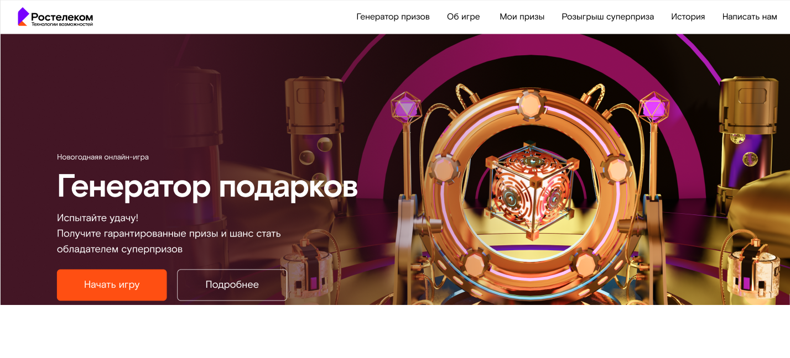
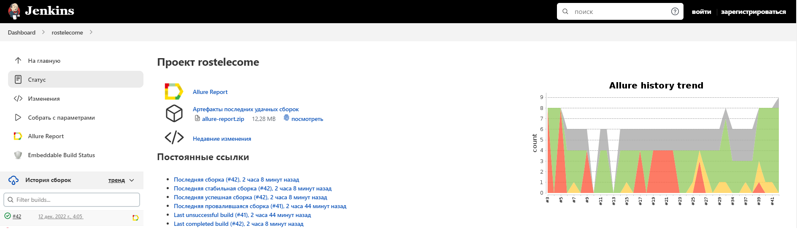
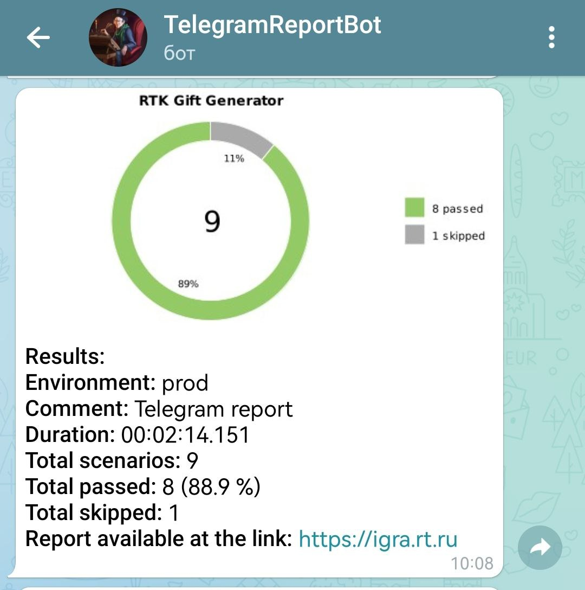
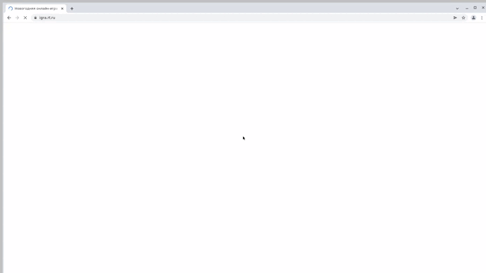

# Проект по автоматизации тестирования для новогодней игры Ростелеком

<a target="_blank"  href="https://igra.rt.ru/"> Новогодняя онлайн-игра | Генератор подарков</a>
<p align="center">
<a href="https://igra.rt.ru/"></a>

</p>

## :scroll: Содержание:

- [Технологии и инструменты](#rocket-технологии-и-инструменты)
- [Реализованные проверки](#scroll-реализованные-проверки)
- [Сборка в Jenkins](#-jenkins-job)
- [Запуск тестов из терминала](#computer-Запуск-тестов-из-терминала)
- [Отчет в Telegram](#-уведомление-в-telegram-при-помощи-бота)
- [Видео примеры прохождения тестов](#-примеры-видео-о-прохождении-тестов)

## :rocket: Технологии и инструменты

<p align="center">
<a href="https://www.jetbrains.com/idea/"></a>
<a href="https://www.java.com/"></a>
<a href="https://github.com/"></a>
<a href="https://junit.org/junit5/"></a>
<a href="https://gradle.org/"></a>
<a href="https://selenide.org/"></a>
<a href="https://aerokube.com/selenoid/"></a>
<a href="https://github.com/allure-framework/allure2"></a>
<a href="https://www.jenkins.io/"></a>
</p>

## :scroll: Реализованные-проверки

- :heavy_check_mark: Проверка работы разделов в неавторизованной зоне;
- :heavy_check_mark: Авторизация пользователя;
- :heavy_check_mark: Кнопка 'отправить' в разделе 'Написать нам' не кликабельна при незаполненных полях;

## </a> Jenkins job
<a target="_blank" href="https://jenkins.autotests.cloud/job/rostelecome/">Сборка в Jenkins</a>
<p align="center">
<a href="https://jenkins.autotests.cloud/job/rostelecome/"></a>
</p>

### Параметры сборки в Jenkins:

* BROWSER_NAME (браузер, по умолчанию chrome)
* BROWSER_VERSION (версия браузера, по умолчанию 99.0)
* BROWSER_SIZE (размер окна браузера, по умолчанию 1920x1080)
* REMOTE_DRIVER_URL (логин, пароль и адрес удаленного сервера selenoid)


### :computer: Запуск тестов из терминала

```bash
gradle clean test
```

### :robot: Удаленный запуск:

```bash
clean
test
-DremoteUrl=https://${LOGIN}:${PASSWORD}@${REMOTE_DRIVER_URL}/wd/hub
-Dbrowser_name=${BROWSER_NAME}
-Dbrowser_version=${BROWSER_VERSION}
-Dbrowser_size=${BROWSER_SIZE}
-DvideoStorage=https://${REMOTE_DRIVER_URL}/video/
```


## </a> Уведомление в Telegram при помощи бота

<p align="center">

</p>

### </a> Примеры видео о прохождении тестов

<p align="center">

</p>